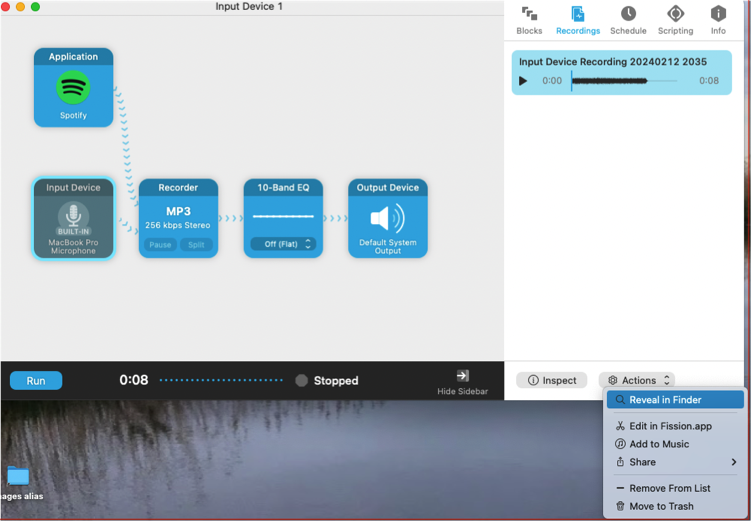

## How to Make Audio and Video Examples at Harris Music Library
The Quiet Reading Room of the Harris Music Library at Haverford College features Mac workstations equiped to help you produce audio and video examples for your music scholarship projects.  The stations include the following software:

* Camtasia (for video and audio editing)
* Audio Hijack (to capture sound from any application)
* Fission (to edit sound clips)
* Reaper (also for sound editing)

These are not meant to replace production tools such as ProLogic.  But together these tools provide an easy path for making audio or video examples to accompany a paper or presentation, or ways to make high-quality video or audio podcasts that combine sounds, narration and moving or still images.

The stations also include DVD drives (so you can make examples from CD or DVD recordings), Rode USB microphones (for narration), and headphones (so you can monitor and review your work).

You will need to bring **your own USB drive**, or be ready to log into Gdrive or OneDrive remotely (via a browser) so that you can save your work. Don't expect to leave your work on the shared computer.

## Logging In

The workstations look like others on campus, with the usual log in.  Of course you are welcome to use these machines in the customary way with your Haverford or Bryn Mawr ID. 

But WAIT! You won't find the audio/video software this way!  Use the **Course ID** (like 'musc229') and the password provided by your instructor.  

## Find the Audio and Video Applications

You will find links to Camtasia and the other specialized software in the desktop folder at the top right--for instance 'music251' as shown below:

Open the folder to find the aliases and launch the program you need:

## Audio Hijack

Audio Hijack is great way to record sound from any application, a microphone, or the entire computer system.  

[Read the manual online.](https://rogueamoeba.com/support/manuals/audiohijack/)

### Getting Started

There are lots of possibilities, but [read this quick guide](https://rogueamoeba.com/support/manuals/audiohijack/?page=startingsimple) to get started!

### The Audio Hijack Grid

The most important concept in Audio Hijack is the **grid**--the pipeline through which your audio will flow from source to recorder and to monitor (output).  Learn more about the audio grid and the library of available 'blocks' [here.](https://rogueamoeba.com/support/manuals/audiohijack/?page=masteringsessions)

### The Recorder Block

The recorder block has lots of great features that allow you to name your files as you go.  For example it's possible 'tags' to your recordings that automatically append date, or time, or a track number as you work.  If you take notes on the segments recorded, you can use these tags to find and organize your files later. Read more about the [Recorder Block here.](https://rogueamoeba.com/support/manuals/audiohijack/?page=recorderblock)

### Where are the Output Files?

Find your recordings at the **sidebar** at the right of the main interface. Notice that you can toggle between a view of the "blocks" and the "recordings". Read more about the [sidebar here.](https://rogueamoeba.com/support/manuals/audiohijack/?page=sidebarcontrols)

The recordings are stored on your computer--you can:

* **Review and listen** to them in this program, or even delete them
* **Open them via the Finder** (and in turn rename, organize, or move them)
* **Open them in Fission**, the companion program that is great for trimming your clips, or adding fade-in/fade-out effects

## Fission

Fission is a companion program to Audio Hijack that makes fast work of:

* Cropping, Deleting, and Splitting
* Fades
* Volume adjustment and normalization
* Format conversion
* Editing Metadata

[Read the manual online.](https://rogueamoeba.com/support/manuals/fission/?page=introduction)

### Main Edit Window

### Crop, Delete, Split, Insert Silence

These are probably the most important techniques, which help you find just the region you need for your example. Learn how [via the manual.](https://rogueamoeba.com/support/manuals/fission/?page=removingandadding).  Also learn about [adding split points here.](https://rogueamoeba.com/support/manuals/fission/?page=splitting)

### Fade In and Out

Fades are another good technique to make good examples for presentations or to link to a paper. Learn how [via the manual.](https://rogueamoeba.com/support/manuals/fission/?page=volumeadjustment)

## Camtasia

