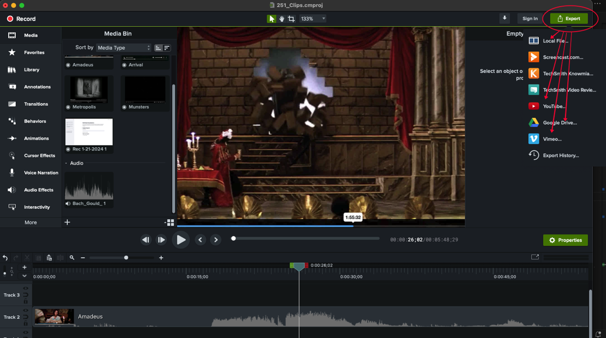
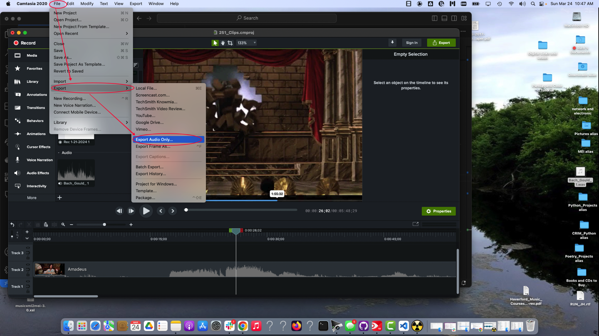

# How to Make Audio and Video Examples at Harris Music Library

The Quiet Reading Room of the Harris Music Library at Haverford College features Mac workstations equiped to help you produce audio and video examples for your music scholarship projects.  The stations include the following software:

* **Camtasia** (for video and audio editing)
* **Audio Hijack** (to capture sound from any application)
* **Fission** (to edit sound clips)
* **Reaper** (also for sound editing)

These are not meant to replace production tools such as ProLogic.  But together these tools provide an easy path for making audio or video examples to accompany a paper or presentation, or ways to make high-quality video or audio podcasts that combine sounds, narration and moving or still images.

The stations also include **DVD drives** (so you can make examples from CD or DVD recordings), **Rode USB microphones** (for narration), and headphones (so you can monitor and review your work).

The workstations are for *temporary storage* of your working files. It's thus a good idea to back things up:  on **your own USB drive**, **Gdrive** or **OneDrive**.  You will need to log into these services via a browser, since you are not actually logged in with your regular user account on the workstation itself. *Don't expect to leave your work on the shared computer!*

Note that **Camtasia** files are stored in a proprietary format until you export them to MP3 (for audio alone) or MP4 (for video and audio together).  Yes, you can back them up on Gdrive, etc, but be careful!

## Logging In

The workstations look like others on campus, with the usual log in.  Of course you are welcome to use these machines in the customary way with your Haverford or Bryn Mawr ID. 

But WAIT! You won't find the audio/video software this way!  Use the **Course ID** (like 'musc229') and the password provided by your instructor.  

## Find the Audio and Video Applications

You will find links to Camtasia and the other specialized software in the desktop folder at the top right--for instance 'music251' as shown below:

Open the folder to find the aliases and launch the program you need:

# Audio Hijack

Audio Hijack is great way to record sound from any application, a microphone, or the entire computer system.  

[Read the manual online.](https://rogueamoeba.com/support/manuals/audiohijack/)

### Getting Started

There are lots of possibilities, but [read this quick guide](https://rogueamoeba.com/support/manuals/audiohijack/?page=startingsimple) to get started!

### The Audio Hijack Grid

The most important concept in Audio Hijack is the **grid**--the pipeline through which your audio will flow from source to recorder and to monitor (output). [Learn more about the audio grid and the library of available 'blocks'.](https://rogueamoeba.com/support/manuals/audiohijack/?page=masteringsessions)

### The Recorder Block

The recorder block has lots of great features that allow you to name your files as you go.  For example it's possible 'tags' to your recordings that automatically append date, or time, or a track number as you work.  If you take notes on the segments recorded, you can use these tags to find and organize your files later. [Learn more about the Recorder Block.](https://rogueamoeba.com/support/manuals/audiohijack/?page=recorderblock)

### Where are the Output Files?

Find your recordings at the **sidebar** at the right of the main interface. Notice that you can toggle between a view of the "blocks" and the "recordings". [Learn more about the sidebar.](https://rogueamoeba.com/support/manuals/audiohijack/?page=sidebarcontrols)

The recordings are stored on your computer--you can:

* **Review and listen** to them in this program, or even delete them
* **Open them via the Finder** (and in turn rename, organize, or move them)
* **Open them in Fission**, the companion program that is great for trimming your clips, or adding fade-in/fade-out effects

# Fission

Fission is a companion program to Audio Hijack that makes fast work of:

* Cropping, Deleting, and Splitting
* Fades
* Volume adjustment and normalization
* Format conversion
* Editing Metadata

[Read the manual online.](https://rogueamoeba.com/support/manuals/fission/?page=introduction)

### Main Editing Window

When you open any audio file in Fission you will come to the main editing window.  [Learn more via the manual.](https://rogueamoeba.com/support/manuals/fission/?page=basics)

 

### Crop, Delete, Split, Insert Silence

These are probably the most important techniques, which help you find just the region you need for your example. Select a region and then apply the crop tool to get just that portion.  Learn more [via the manual.](https://rogueamoeba.com/support/manuals/fission/?page=removingandadding).  [Learn more about adding split points here.](https://rogueamoeba.com/support/manuals/fission/?page=splitting)

 

### Fade In and Out, Volume Adjustment

Fades are another good technique to make good examples for presentations or to link to a paper. In brief, you select a region of the file, then click the fade-in or fade-out icon to create the effect.  [Learn more via the manual.](https://rogueamoeba.com/support/manuals/fission/?page=volumeadjustment)

 

### Format Conversion

Normally you will use mp3 files for your examples.  But there are a variety of digital file formats available; [learn how to convert one to another (although sometimes signal loss could be involved) via the manual.](https://rogueamoeba.com/support/manuals/fission/?page=formatconversion)

 

### Metadata

It is good practice to keep your own notes (a spreadsheet is good) about your music clips--the number and status of them will quickly become overwhelming otherwise. Naming your clips consistently will make things much easier when it comes time to assemble them as examples for an essay or include them in a podcast or Camtasia video.  For example:  **FREEDMAN_229_EX3.mp3**. [See the Music Style Guide](https://github.com/RichardFreedman/music_style_guide/blob/main/sections/7_audio_example.md) for some good suggestions on how to name your examples.

You can also edit metadata for each clip with Fission.  [Learn more in the manual.](https://rogueamoeba.com/support/manuals/fission/?page=basics)

 

# Camtasia

Camtasia is a great resource for making audio or video podcasts. The Harris Workstations feature **Camtasia 2021**.  [Learn more via the manual.](https://www.techsmith.com/blog/wp-content/uploads/2022/01/Camtasia-Help-2021.0.4EN.pdf).  The Camtasia 2023 software is slightly different places, but the [videos available on the Camtasia Tutorial site](https://www.techsmith.com/learn/tutorials/camtasia) are still quite useful.

Camtasia is powerful software.  The basics are not difficult, and many of the advanced features are not necessary in order to have good results.  On the other hand you can also spend a lot of time making things 'perfect', so it is important to be reasonable, and to plan ahead.

### Plan Your Work

Consider the following suggestions:

* Write an outline, then a script.  This is the best way to know where you are going, and how all the segments go together. 

* Make a list of all the examples you will use (images, texts, audio, and video).  

* You can make audio and video recordings directly in Camtasia, including screen captures, system audio, narration, or even your workstation camera.  

* It is also sometimes useful to create your audio clips with Hijack and Fission, then import them to the Media Bin.

* It is also sometimes useful to create static slides (such as some score excerpt, or text, or perhaps a still image) on Google slides, then narrate as you move through those slides.*

### Save Your Work!

Be sure to save your project frequently!  Yes, you can "undo", but save before each major edit!

The workstations are for *temporary storage* of your working files.  Please use the **Student Work Folder** (see the alias on the workstation desktop) for this purpose.  Be sure to save work only in your own folder!

It's thus a good idea to back things up:  on **your own USB drive**, **Gdrive** or **OneDrive**.  You will need to log into these services via a browser, since you are not actually logged in with your regular user account on the workstation itself. *Don't expect to leave your work on the shared computer!*

Note that **Camtasia** files are stored in a proprietary format until you export them to MP4.  Yes, you can back them up on Gdrive, etc, but be careful!

### Getting Started

When you start Camtasia for the first time you will see something like the following.  Select a **New Project**. 

If you are returning to edit previous work, then use **Open Project**.  You might need to navigate to the Student Work Folder and look for your own subfolder. It will look something like the following.  Camtasia projects are stored in a proprietary format with the **cmproj** as the extension. 

Final exported ("rendered") files in MP4 (for video and audio), or MP3 (for audio only) or other formats are for use with browsers or media players.  You cannot open them as a Camtasia Project.  But you *can* add WAV, MP4, MP3 or similar files to your **Media Bin** for a given project and use them in your work.  See more below . . .

 

### The Main Editor

The main Camtasia editor will look something like this:

* At the far left:  menus that allow you to choose areas for media, transitions (like fades), and captions
* At the center-left:  the options avaiable for whichever of the menu items you have selected (in this case, the "Media Bin", which is your collection of clips or recordings)
* In the center:  a view of the video at a particular instant, as given by the cursor/playhead on the timeline
* At the bottom:  playback controls, a 'time scale' adjustment (so you can zoom in or zoom out across time), and finally the "Canvas" itself, consisting of layers of audio and video tracks that make up your project.  
* At the top right:  button to export your file.

 

### The Basic Steps

In the course of making a project you will:

* Record clips (via screen capture) or add audio clips you made with Hijack+Fission to the "Media Bin".  
* Drag the clips to the Canvas in the order you want 
* Align, trim, and move the clips on the canvas
* Adjust audio, add transitions or perhaps captions and titles
* Export the finished project to MP3 (for audio) or MP4 (note that a 10 minute video might take 20 minutes to export, so plan accordingly)

### Different Sources Require Different Solutions:  Streaming Video vs DVD

If you are **streaming video content via your browser** (for example, something from YouTube or perhaps a electronic resource you access via Tripod):

* A. Use **Chrome** as your browser
* B. Open *preferences*:

* C. Look for *system*:

* D. **Deactivate** the "Use graphics acceleration when available" feature.  That is: *turn it off.*

Intead of this:

Your screen should look like this:

* E. Relaunch Chrome:

If you are **taking clips from a DVD**:

* Make sure the DVD drive is connected, or you can see it on the side of the machine.

* Insert your DVD.  If Apple DVD Player launches, quit it!

* Launch **VLC** player instead, and then drag the icon for your DVD (which should be on the desktop) to the VLC player.  Double click on your title to open the DVD in VLC player.

* Use the standard DVD menu to **navigate to the scene you need.**

* Use the controls at the bottom of the viewer to **adjust volume and scroll within the given track**.  Note that you will need to return to the main menu for each new track you want to record.

* Now **record the VLC player window with Camtasia**.  You might want to make the VLC player larger (so you have better resolution).  Use the 'expand' arrows at the lower right of the VLC window for this.

* With Camtasia, be sure to use the **"select region"** feature of the recording dialogue.  And make sure you are **recording System Audio** (but not your microphone!).

### Export Finished Project

#### Export Video and Audio as MP4.  

You can save to local file, to a shared drive, or even to youTube or Vimeo.  Note that a 10-minute video could take 20 minutes to save, so be patient!

For local file export, the dialogue will continue as follows:

#### Export Audio Only as M4a or WAV File

For audio only export, look under the **File** menu at the top left of your screen, then follow the dialogue.

#### Finally:  Respect Fair Use Principles!

### Key Tutorials from Camtasia

[Read the Camtasia 2021 manual](https://www.techsmith.com/blog/wp-content/uploads/2022/01/Camtasia-Help-2021.0.4EN.pdf) to learn more about each step.

Or watch these selected [video tutorials for Camtasia 2023](https://www.techsmith.com/learn/tutorials/camtasia/) (some details might differ, but these are still excellent):

* [Learn Camtasia in Five Minutes](https://www.techsmith.com/learn/tutorials/camtasia/?utm_source=product&utm_medium=cmac&utm_campaign=cm20&ipc_item_name=cmac&ipc_platform=macos)
* [Build Your First Video](https://www.techsmith.com/learn/tutorials/camtasia/record-edit-share/)
*[Basic Edits After Recording](https://www.techsmith.com/learn/tutorials/camtasia/basic-video-edits/)
*[Assemble Your Video](https://www.techsmith.com/learn/tutorials/camtasia/add-video-content/)
*[Export and Share Your Video](https://www.techsmith.com/learn/tutorials/camtasia/export-share/)

Other helpful tutorials:

* [Import and Manage Media](https://www.techsmith.com/learn/tutorials/camtasia/import-manage-media/), such as audio files you create with Hijack+Fission
* [Position Media on the Canvas/Timeline](https://www.techsmith.com/learn/tutorials/camtasia/working-with-the-canvas/)
* [Remove Narration Mistakes with Trim and Split](https://www.techsmith.com/learn/tutorials/camtasia/remove-mistakes/)

# The Music Style Guide for Haverford, Bryn Mawr, and Swarthmore College

### Contents of This Guide

- [Referring to Musical Works](sections/1_works.md)
- [Terminology, Hyphens and Dashes](sections/2_terms.md)
- [Writing About the Past](sections/3_past.md)
- [Citing Sources](sections/4_citing_sources.md)
- [Examples and Fair Use](sections/5_examples_intro.md)
- [Score Examples](sections/6_score_example.md)
- [Audio Examples](sections/7_audio_example.md)
- [Video Examples](sections/8_video_example.md)
- [Transcriptions and Figures](sections/9_transcriptions_figures.md)
- [Making Audio and Video Examples with Hijack, Fission, and Camtasia](audio_video_guide.md)

-----
